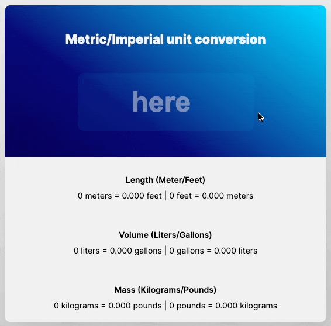

# Unit Converter
This project is taken from the javascript tutorial series prepared by scrimba.

Design file: [click here](https://www.figma.com/file/AdqUVRQCZGP1zRcEvzmJTm/Unit-Conversion?node-id=5%3A13)

## Topics
- I have a better understanding of DOM events with Javascript.
- I learned to use the `onkeyup` feature in input.

## What is onkeyup?

The onkeyup event occurs when the user releases a key (on the keyboard).

## Preview

Play Demo: [click here](https://imhalid.github.io/scrimba-calculator-challenge/)

